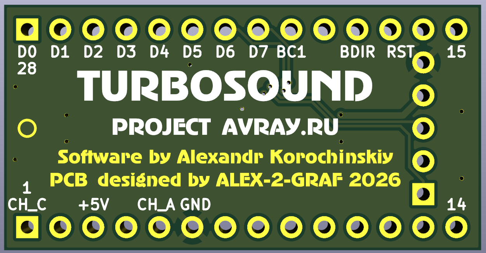
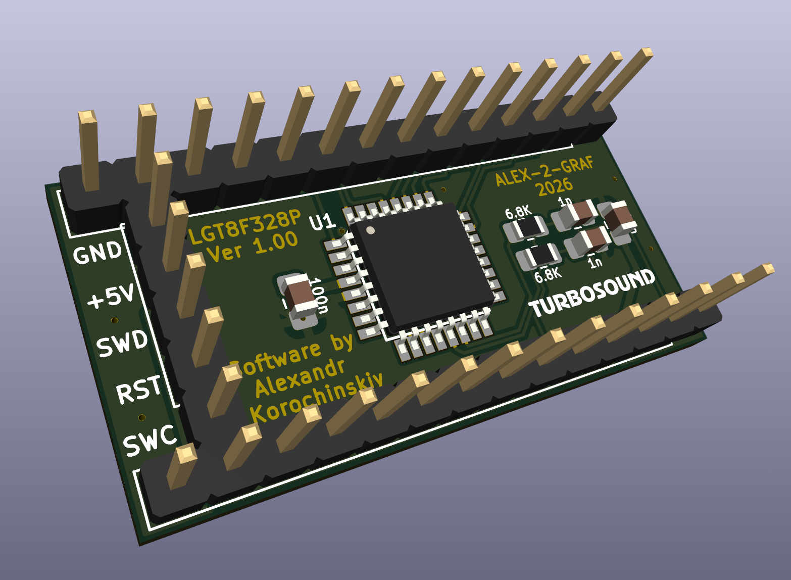
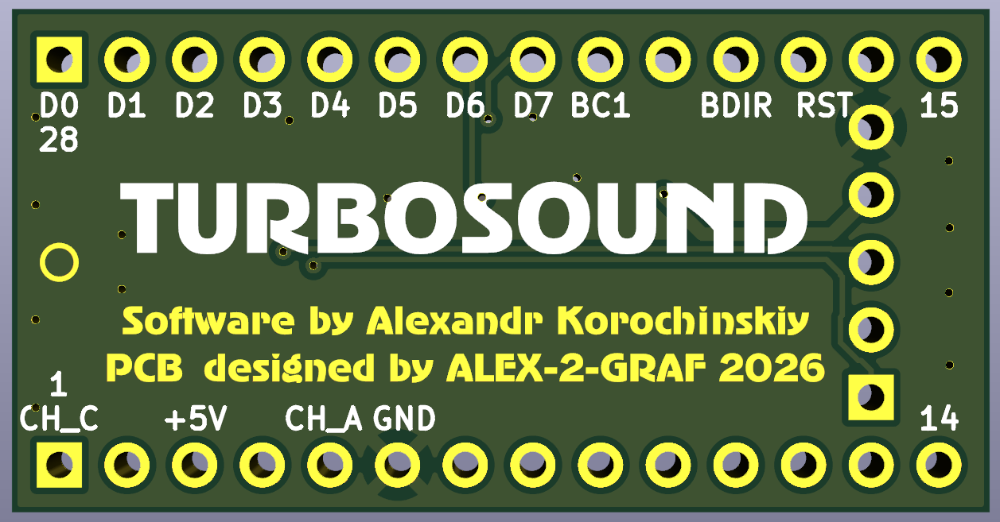
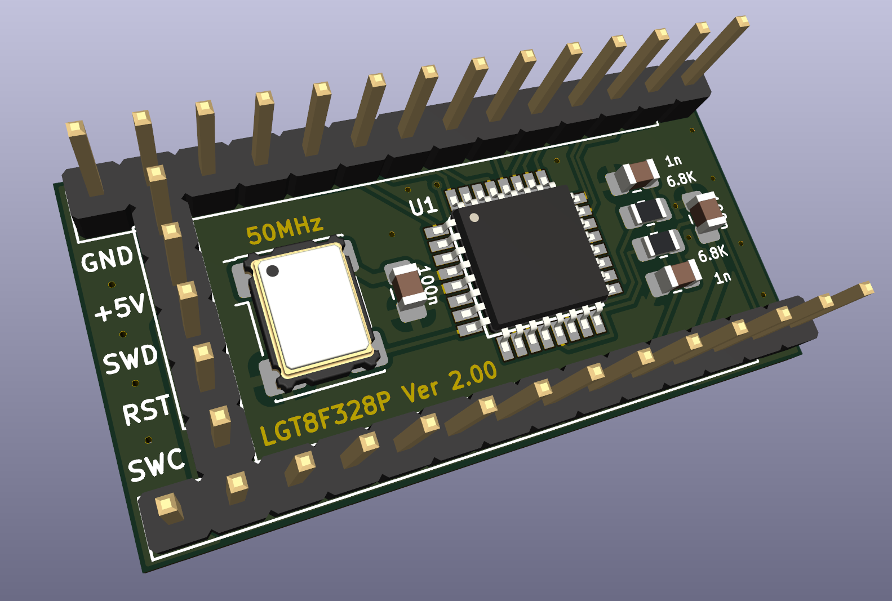
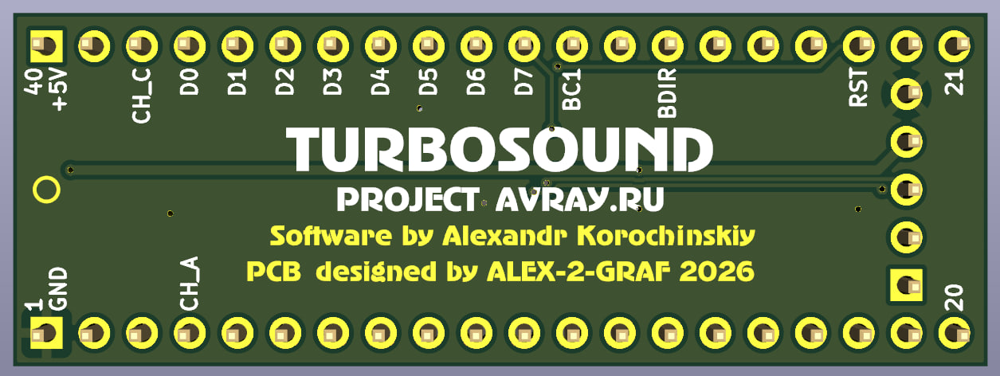
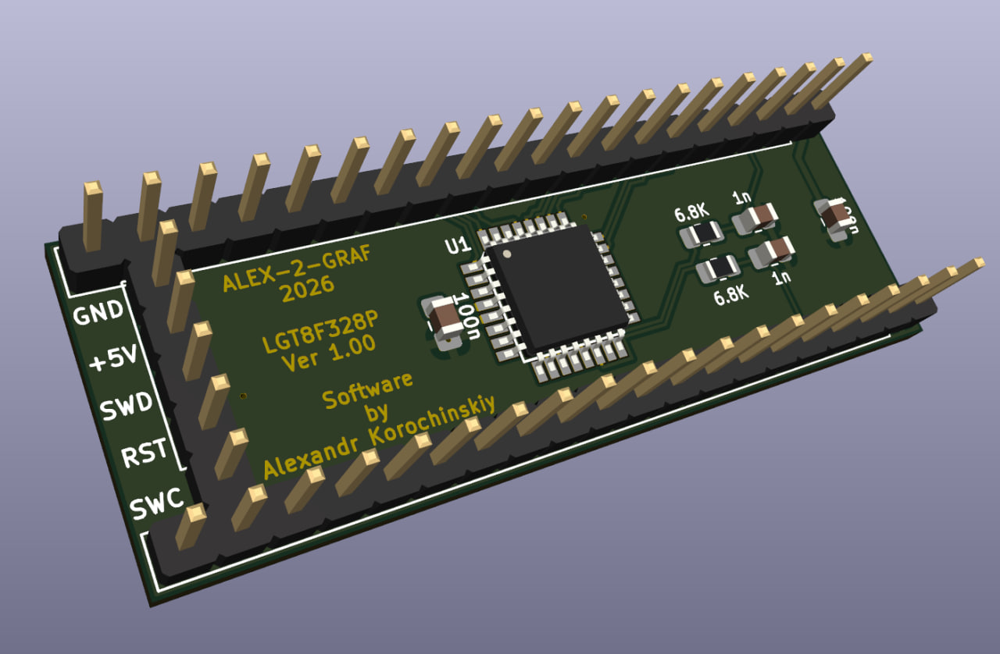
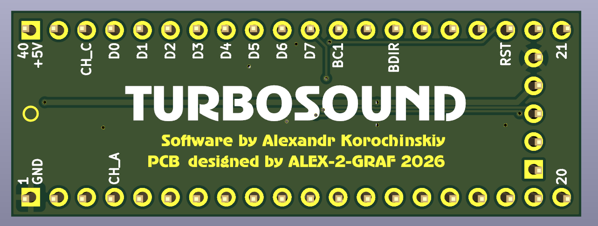
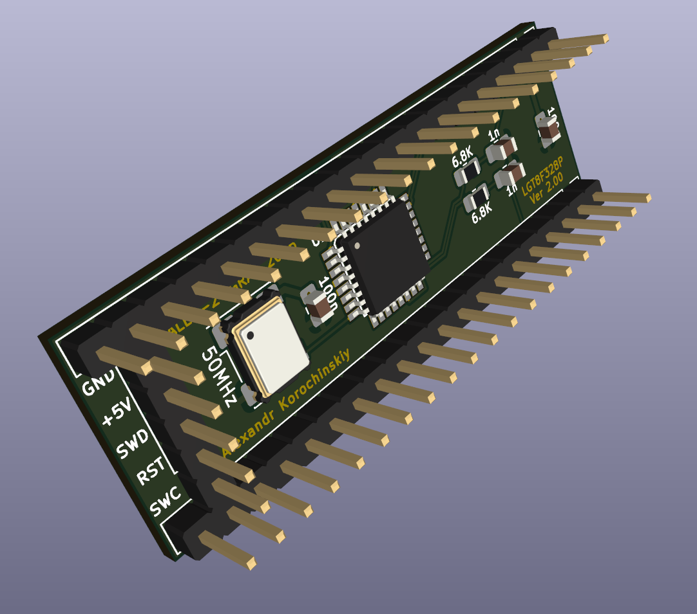

# LGT-Turbo-Sound-emulator
Hardware Turbo Sound (Dual AY/YM) emulator for ZX Spectrum based on the high-speed LGT8F328P microcontroller.
  
> [English](README.en.md) | [Русский](README.md)  
  
# Эмулятор Turbo Sound на микроконтроллере LGT8F328P 🎹⚡
  
Проект аппаратного эмулятора двух музыкальных сопроцессоров AY-3-8910 / YM2149F (стандарт **Turbo Sound**) для компьютеров **ZX Spectrum** и их клонов. 
В основе устройства лежит китайский микроконтроллер **LGT8F328P**, который благодаря тактовой частоте 32 МГц и продвинутой архитектуре позволяет с высокой точностью обрабатывать команды шины Spectrum и генерировать 6-канальный chiptune-звук без задержек.
  
---
  
## ⚙️ Технические особенности реализации
  
*   **Высокое качество звука:** Использование встроенного в LGT8F328P **8-битного цифро-аналогового преобразователя (DAC)**. В отличие от стандартного ШИМ (PWM), это обеспечивает чистый chiptune-звук без высокочастотных шумов и минимизирует обвязку платы.
*   **Максимальное быстродействие:** Использование ядра LGT8F328P на частоте 32 МГц обеспечивает точный тайминг.
*   **Полная совместимость:** Эмуляция стандарта Turbo Sound (6 каналов звука).
*   **Доступность:** Микроконтроллер LGT8F328P значительно дешевле и быстрее, чем ATmega328P.  
  
---
  
## 📐 Разводка плат (Hardware)
  
Все печатные платы спроектированы в программе **KiCad**. В репозитории доступны готовые проекты, схемы, а также Gerber-файлы для заказа на фабриках (JLCPCB, PCBWay и др.).
  
Проект поддерживает **4 варианта аппаратного исполнения** под любые задачи:  
  
**DIP-28 (Без кварца):** Максимально компактный вариант на базе встроенного генератора 32 МГц. Идеален для экономии места.  
  
[Схема](Export/TurboSound_LGT_28p.pdf) [Монтаж](Export/TurboSound_LGT_28p.html) [Gerber](Gerber/TS_LGT_28p_Gerber.zip)  
  
  
  
  
  
**DIP-28 (С кварцем):** Компактный форм-фактор с посадочным местом под внешний генератор (40/48/50 МГц) для высокой точности.  
  
[Схема](Export/TurboSound_LGT_28p_50MHz.pdf) [Монтаж](Export/TurboSound_LGT_28p_50MHz.html) [Gerber](Gerber/TS_LGT_28p_50_Gerber.zip)  
  
  
  
  
  
**DIP-40 (Без кварца):** Удобный формат для прямой установки в стандартную панель процессора/звукового чипа ZX Spectrum без переходников.  
  
[Схема](Export/TurboSound_LGT_40p.pdf) [Монтаж](Export/TurboSound_LGT_40p.html) [Gerber](Gerber/TS_LGT_40p_Gerber.zip)  
  
  
  
  
  
**DIP-40 (С кварцем):** Полноразмерный вариант с внешним тактованием для максимального качества эмуляции.  
  
[Схема](Export/TurboSound_LGT_40p_50MHz.pdf) [Монтаж](Export/TurboSound_LGT_40p_50MHz.html) [Gerber](Gerber/TS_LGT_40p_50_Gerber.zip)  
  
  
  
  
  
---
  
## 💾 Прошивка и конфигурация (Firmware)  
  
Проект поддерживает два режима работы тактового генератора и раздельные прошивки для точной эмуляции звуковых чипов **AY-3-8910** и **YM2149F** (учитывающие особенности их громкостных таблиц).

### **AY-3-8910**  
  
* [TS_Emu_INT_32MHz_AY](Firmware/TS_Emu_INT_32MHz_AY) Внутренний генератор 32 МГц, чип AY-3-8910
* [TS_Emu_INT_37MHz_AY](Firmware/TS_Emu_INT_37MHz_AY) Внутренний генератор 37 МГц, чип AY-3-8910 (рекомендуется для работы без генератора)
* [TS_Emu_EXT_40MHz_AY](Firmware/TS_Emu_EXT_40MHz_AY) Внешний генератор 40 МГц, чип AY-3-8910
* [TS_Emu_EXT_48MHz_AY](Firmware/TS_Emu_EXT_48MHz_AY) Внешний генератор 48 МГц, чип AY-3-8910
* [TS_Emu_EXT_50MHz_AY](Firmware/TS_Emu_EXT_50MHz_AY) Внешний генератор 50 МГц, чип AY-3-8910
  
### **YM2149F**
  
* [TS_Emu_INT_32MHz_YM](Firmware/TS_Emu_INT_32MHz_YM) Внутренний генератор 32 МГц, чип YM2149F
* [TS_Emu_INT_37MHz_YM](Firmware/TS_Emu_INT_37MHz_YM) Внутренний генератор 37 МГц, чип YM2149F (рекомендуется для работы без генератора)
* [TS_Emu_EXT_40MHz_YM](Firmware/TS_Emu_EXT_40MHz_YM) Внешний генератор 40 МГц, чип YM2149F
* [TS_Emu_EXT_48MHz_YM](Firmware/TS_Emu_EXT_48MHz_YM) Внешний генератор 48 МГц, чип YM2149F
* [TS_Emu_EXT_50MHz_YM](Firmware/TS_Emu_EXT_50MHz_YM) Внешний генератор 50 МГц, чип YM2149F
  
---
  
## Инструкция по прошивке  
  
Для прошивки нам понадобится программатор.  
Его можно изготовить из arduino [LarduinoISP](Programmer/LarduinoISP.zip)  
Либо из RP2040 [LarduinoISP](Programmer/RP2040_HRDY_LarduinoISP_Prog.zip)  
  
Далее прошить при помощи [AVRDUDESS](Programmer/AVRDUDESS-2.18-portable.zip) 
  
Исходные материалы [тут](Sources/AY_Emu.rar)
  
Собирается в Atmel Studio 7.0  
  
---
  
## 🤝 Авторы и благодарности

*   **[Александр Корочинский](https://t.me/AlexKorochinskiy)** — автор оригинального кода прошивок эмуляции AY-3-8910 и YM2149F.
*   **[Alex-2-Graf](https://github.com/Alex-2-Graf)** — схемотехника, разводка печатных плат в KiCad, адаптация и оформление проекта.
  
## 📜 Лицензия

Этот проект распространяется под лицензией MIT. Подробнее см. в файле [LICENSE](LICENSE).
